# Distributed Databases Using Replication — Report

**CS6650 Distributed Systems — HW10**
**Author:** Yaoyi Wang
**Repository:** [INSERT YOUR KHOURY GIT REPO URL HERE]

---

## 1. Code Explanation

### 1.1 Project Structure

```
kv-database/
├── cmd/
│   ├── server/main.go          # Entry point — routes by ROLE env var
│   └── loadtest/main.go        # Load test client
├── internal/
│   ├── store/kvstore.go        # Thread-safe in-memory KV store
│   └── replication/
│       ├── leader.go           # Leader-Follower replication logic
│       └── leaderless.go       # Leaderless coordinator logic
├── tests/
│   ├── leader_consistency_test.go
│   └── leaderless_consistency_test.go
├── docker-compose-leader.yml
├── docker-compose-leaderless.yml
├── Dockerfile
└── plot_results.py
```

### 1.2 KV Store Core (`kvstore.go`)

The foundation is a thread-safe hash map protected by `sync.RWMutex`. Each entry stores a value and a logical version number that increments on every write. Two setter methods exist:

- `Set(key, value)` — increments version locally (used by the writer/coordinator).
- `SetWithVersion(key, value, version)` — applies a specific version only if it is newer than the existing one (used by followers receiving replicated data). This prevents stale replications from overwriting newer data.

### 1.3 How Different N/R/W Cases Work

All five nodes run the same binary. The `ROLE` environment variable (`leader`, `follower`, or `leaderless`) determines behavior. `W`, `R`, `N`, and `PEERS` are also passed as environment variables.

#### Leader-Follower: What happens when a WRITE arrives?

1. Client sends `PUT /set?key=x&value=y` to the Leader.
2. Leader writes to its local store, incrementing the version. This counts as 1 ack.
3. Leader iterates through its follower list, sending `POST /internal/set` to each one. After each send, the Leader sleeps 200ms.
4. Each Follower receives the internal set request, sleeps 100ms, then applies the update via `SetWithVersion` and returns 200-OK.
5. Depending on W:
   - **W=5:** Leader waits for all 4 followers to ack, then returns 201 to client.
   - **W=1:** Leader returns 201 immediately after its local write. Replication happens asynchronously in a background goroutine.
   - **W=3:** Leader returns 201 after receiving 2 follower acks (self + 2 = 3).

#### Leader-Follower: What happens when a READ arrives?

1. Client sends `GET /get?key=x` to any node.
2. The node performs a quorum read based on R:
   - **R=1:** Returns its own local value immediately. No network calls.
   - **R=5:** Sends `GET /internal/get` to all other nodes in parallel. Each responding node sleeps 50ms before replying. Collects all 5 responses (including local) and returns the entry with the highest version.
   - **R=3:** Same as R=5 but only waits for 2 remote responses (self + 2 = 3), then returns the highest version.

#### Leaderless: What happens when a WRITE arrives?

1. Client sends `PUT /set` to any node. That node becomes the **Write Coordinator**.
2. Coordinator writes locally (version++), then sends `POST /internal/set` to all 4 peers, sleeping 200ms between each send.
3. Since W=N=5, the Coordinator waits for all 4 peers to ack before returning 201.

#### Leaderless: What happens when a READ arrives?

Since R=1, the node simply returns its own local value. No quorum read.

### 1.4 Tricky Parts and Error Handling

**Version conflict resolution:** `SetWithVersion` only applies an update if the incoming version is strictly greater than the existing version. This prevents out-of-order replications from corrupting data — critical in the W=1 async case where multiple writes to the same key may arrive at followers in different orders.

**Quorum read correctness:** When R > 1, the reader collects responses from R nodes and picks the highest version. If a node doesn't have the key at all (returns 404), that response is treated as "not found" and doesn't affect the max-version selection. This means a quorum read only returns "not found" if no node in the quorum has the key.

**The `local_read` endpoint:** This is a testing-only endpoint that always reads the local store without any quorum logic. It exists specifically to expose the inconsistency window during tests — by bypassing the quorum, we can observe that followers haven't been updated yet while a write is in progress.

### 1.5 AI Assistance Disclosure

Claude (Anthropic) was used as a coding assistant throughout this assignment. It helped with code structure, the replication manager design, test scaffolding, the load test client, and the plotting script. All code was reviewed, understood, and tested by the author.

---

## 2. Load Test Design

### 2.1 How the Test Generator Works

The load tester generates a plan of 2000 requests with configurable write/read ratio. Each request randomly picks a key from a pool of 10 keys.

**Guaranteeing temporal locality:** Using only 10 keys with 2000 requests means each key is accessed ~200 times on average. With 20 concurrent workers, reads and writes to the same key are naturally clustered within milliseconds of each other. This creates frequent opportunities to observe stale reads and exercises the "return most recent version" logic in quorum reads.

**Stale read detection:** The client maintains a `versionTracker` — a map of the latest known version per key, updated after every successful write. When a read returns a version lower than the tracker's value, it is flagged as stale.

### 2.2 Test Configurations

| Config | W | R | Description |
|--------|---|---|-------------|
| Leader W=5,R=1 | 5 | 1 | Strong write consistency, fast local reads |
| Leader W=1,R=5 | 1 | 5 | Fast writes, quorum reads |
| Leader W=3,R=3 | 3 | 3 | Balanced quorum |
| Leaderless W=5,R=1 | 5 | 1 | No single leader, strong write consistency |

Each configuration was tested with write ratios of 1%, 10%, 50%, and 90%.

---

## 3. Results

### 3.1 Read Latency Distributions

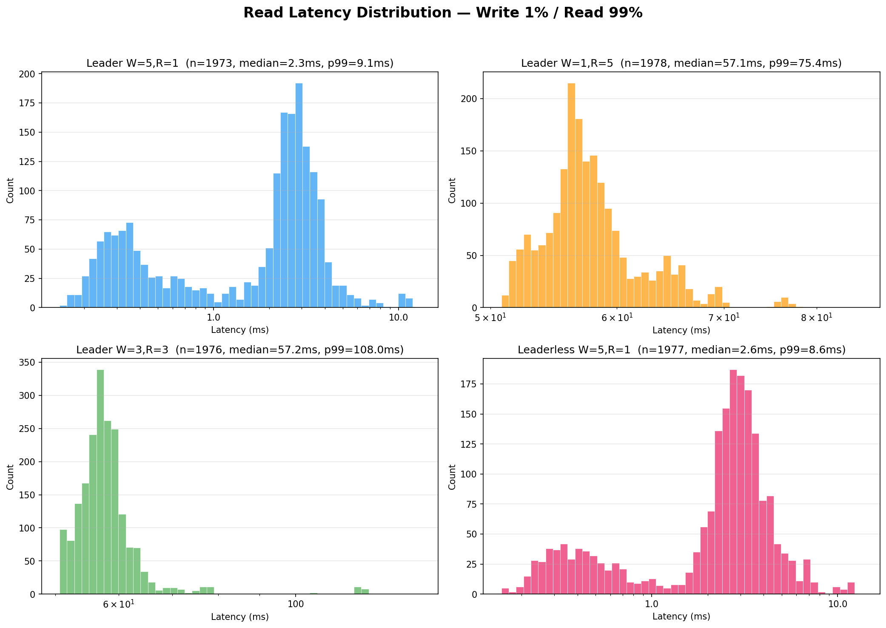

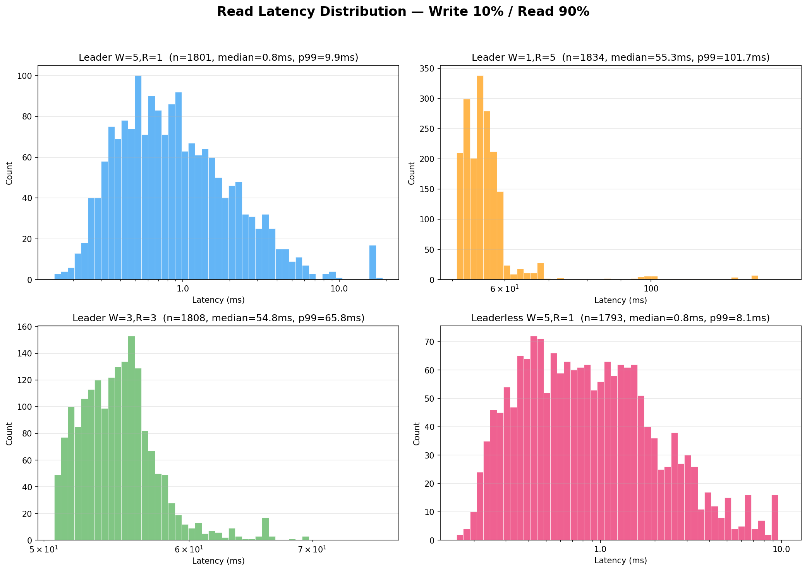

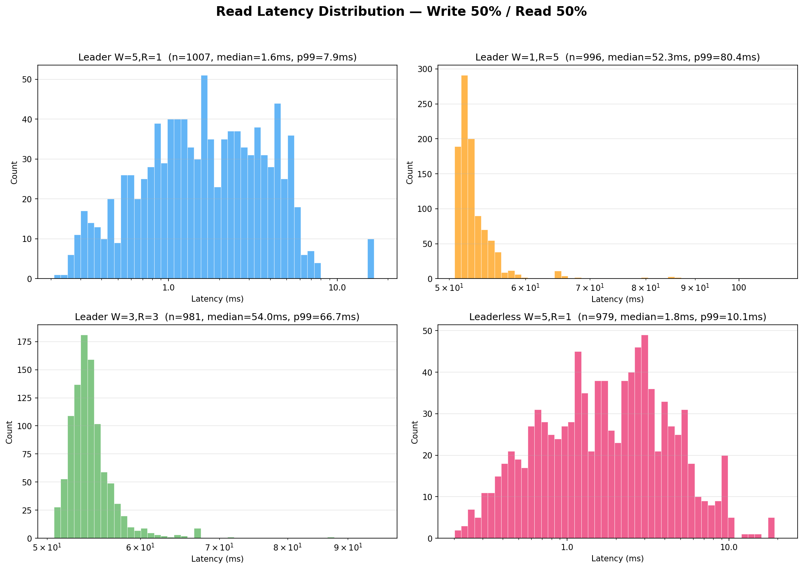

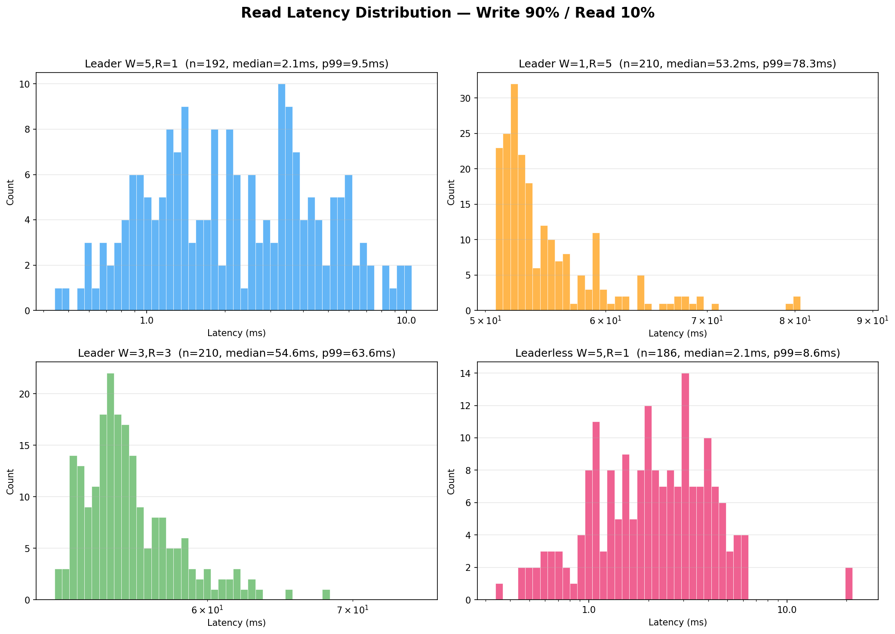

### 3.2 Write Latency Distributions

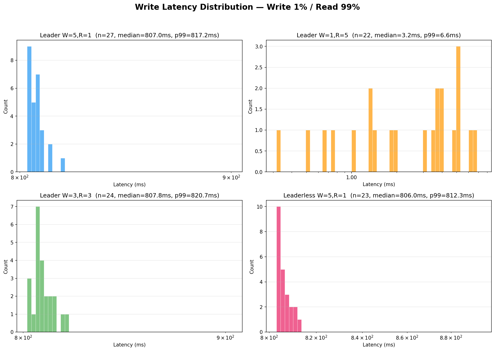

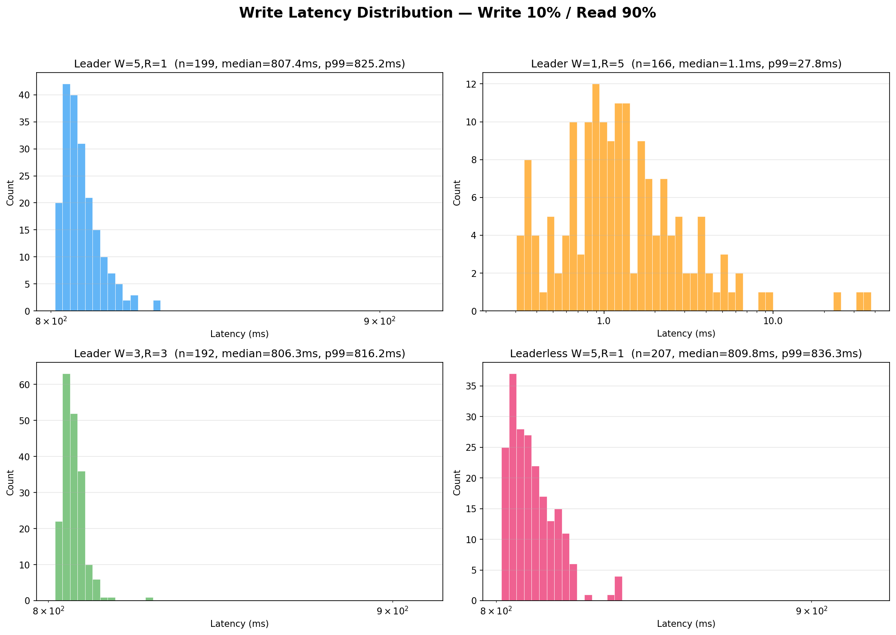

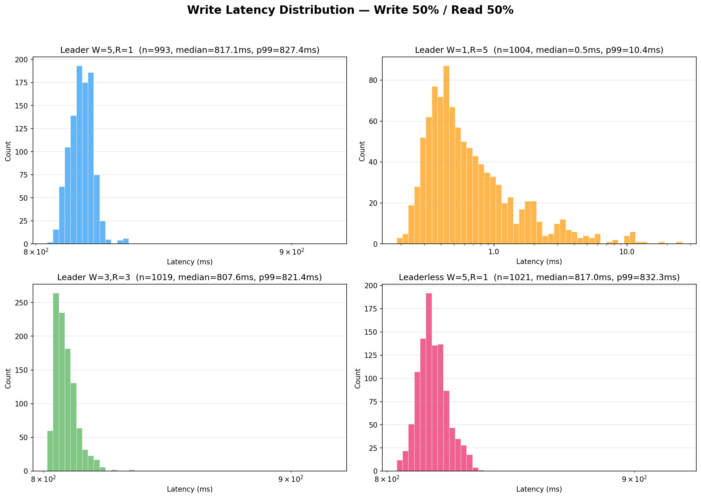

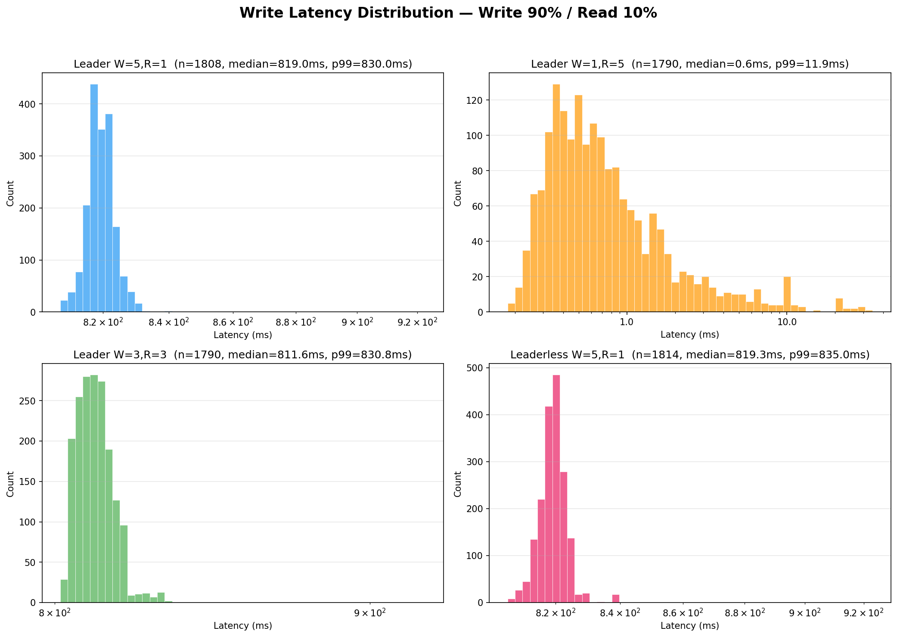

### 3.3 Read-Write Interval Distributions

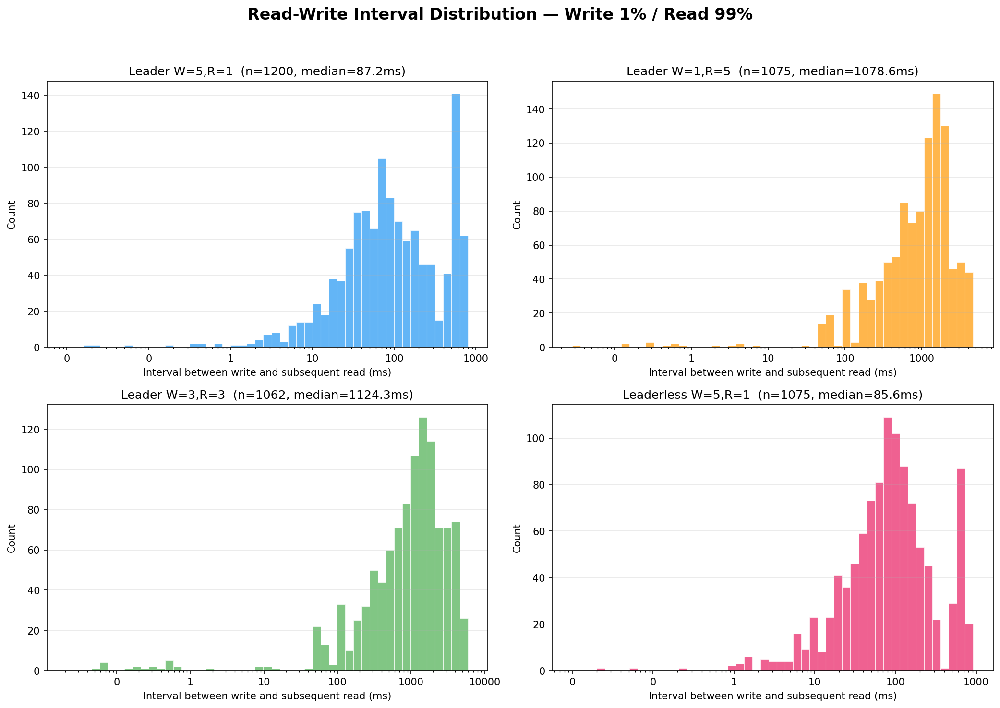

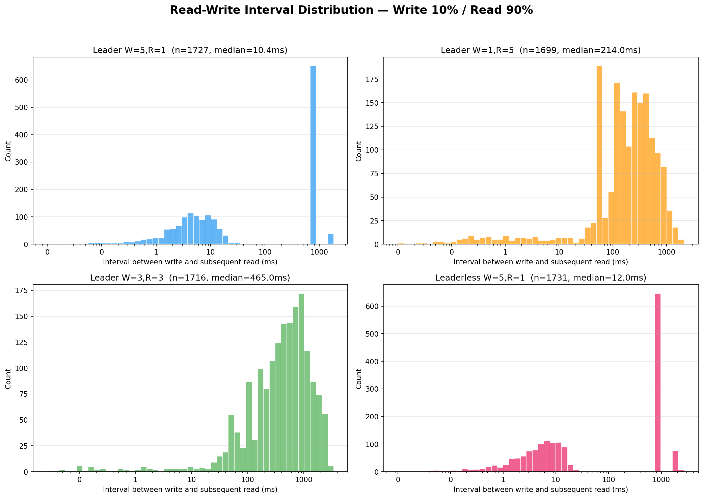

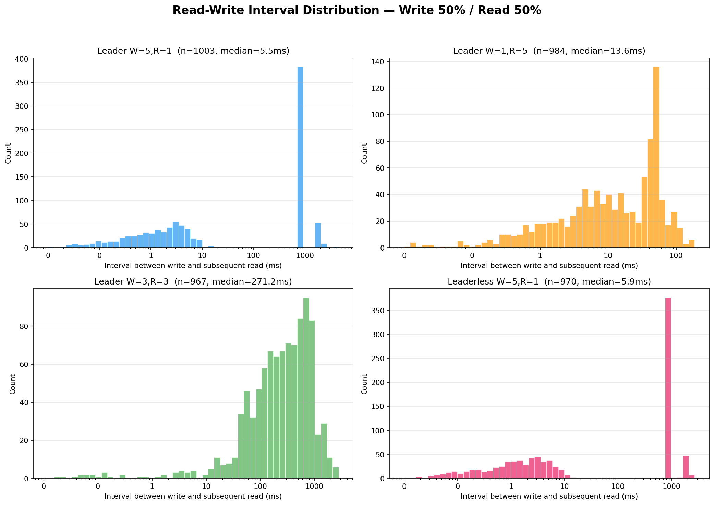

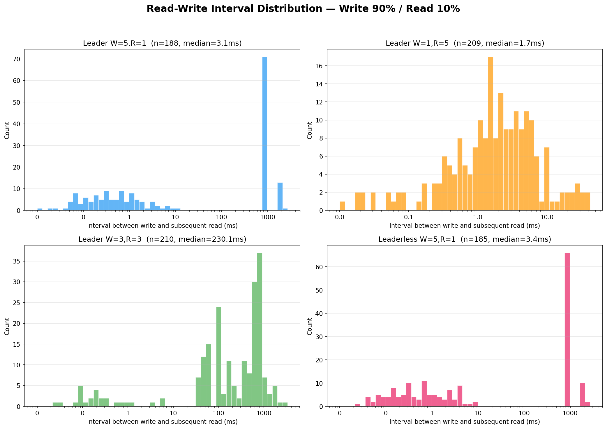

### 3.4 Stale Read Summary

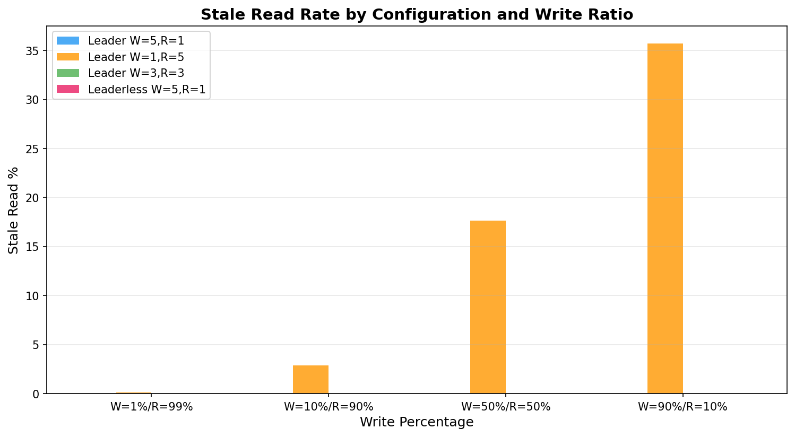

### 3.5 Average Latency Comparison

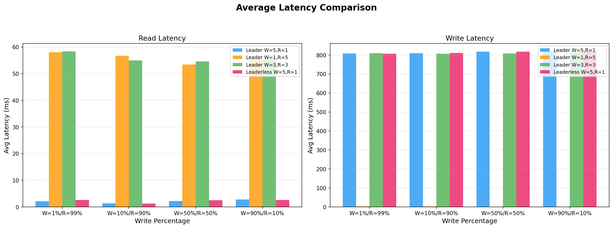

---

## 4. Discussion

### 4.1 Read Latency Analysis

Read latency splits into two groups determined entirely by R:

**R=1 (Leader W=5/R=1 and Leaderless):** Median ~1–3ms. Reads hit a single node's in-memory hash map with no network calls. The long tail to ~10ms is caused by Go GC pauses and Docker networking overhead.

**R=3 and R=5 (Leader W=3/R=3 and W=1/R=5):** Median ~53–58ms. This is dominated by the 50ms sleep each follower applies before responding to internal read requests. The W=1/R=5 config shows occasional outliers above 100ms when a slow follower delays the full-quorum response.

Read latency is stable across write ratios because reads are independent operations that don't contend with the write path.

### 4.2 Write Latency Analysis

**W=1 (Leader W=1/R=5):** Sub-millisecond median (~0.5ms). The leader writes locally and returns immediately. Async replication runs in a background goroutine. This is ~800x faster than other configurations but sacrifices write durability.

**W=3, W=5, and Leaderless:** All cluster at ~807–820ms. The leader sends to followers sequentially with 200ms sleep between each, and each follower adds 100ms processing time. For W=5: 4 followers × 200ms = 800ms plus overhead. W=3 is similar because the sequential send pattern still dominates.

The tight distribution (p99 only ~10–20ms above median) confirms that latency is dominated by the deterministic sleep values, not system variance.

### 4.3 Stale Read Analysis

**Only Leader W=1/R=5 produces stale reads.** The rate scales with write volume:

| Write Ratio | Stale Read Rate |
|-------------|----------------|
| 1% writes   | 0.1% |
| 10% writes  | 2.9% |
| 50% writes  | 17.7% |
| 90% writes  | 35.7% |

This occurs because W=1 returns before followers are updated. Although R=5 reads all nodes and picks the highest version, the client's stale-read detection races with concurrent in-flight async replications.

**All other configurations achieve 0% stale reads** because:
- **W=5, R=1:** Every node is confirmed updated before the write response, so any single-node read sees the latest value.
- **W=3, R=3:** The quorum intersection property (W + R = 6 > N = 5) guarantees that at least one node in every read quorum participated in the latest write.
- **Leaderless W=5, R=1:** Same guarantee as Leader W=5/R=1.

### 4.4 Which Configuration is Best for What?

**Leader W=5, R=1** — Best for **read-heavy, consistency-critical** applications like user profile lookups or configuration stores. Reads are extremely fast (~2ms) with zero stale reads, but writes are slow (~810ms), making it unsuitable for write-heavy workloads.

**Leader W=1, R=5** — Best for **write-heavy, eventual-consistency-tolerant** applications like logging, analytics ingestion, or event streams. Writes are sub-millisecond, but reads are slow (~55ms) and frequently stale. Only appropriate when reading outdated data is acceptable.

**Leader W=3, R=3** — The **balanced "safe default"** for applications needing both consistency guarantees and reasonable performance, such as e-commerce inventory or financial systems. Quorum intersection ensures zero stale reads while offering moderate latency for both operations.

**Leaderless W=5, R=1** — Best for **high-availability read-heavy** applications like DNS or CDN origin servers. Performance matches Leader W=5/R=1, but eliminates the single point of failure — any node can accept writes, improving availability if one node goes down.

### 4.5 CAP Theorem Trade-off

Our results directly demonstrate the CAP theorem in practice: no configuration simultaneously achieves fast writes, fast reads, and strong consistency. Each W/R setting trades one property for another, and the "right" choice depends entirely on the application's tolerance for latency versus staleness.
