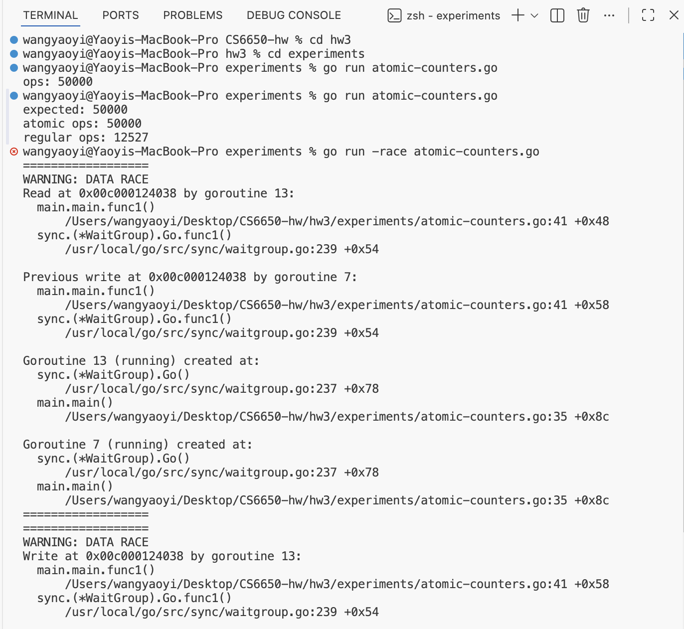
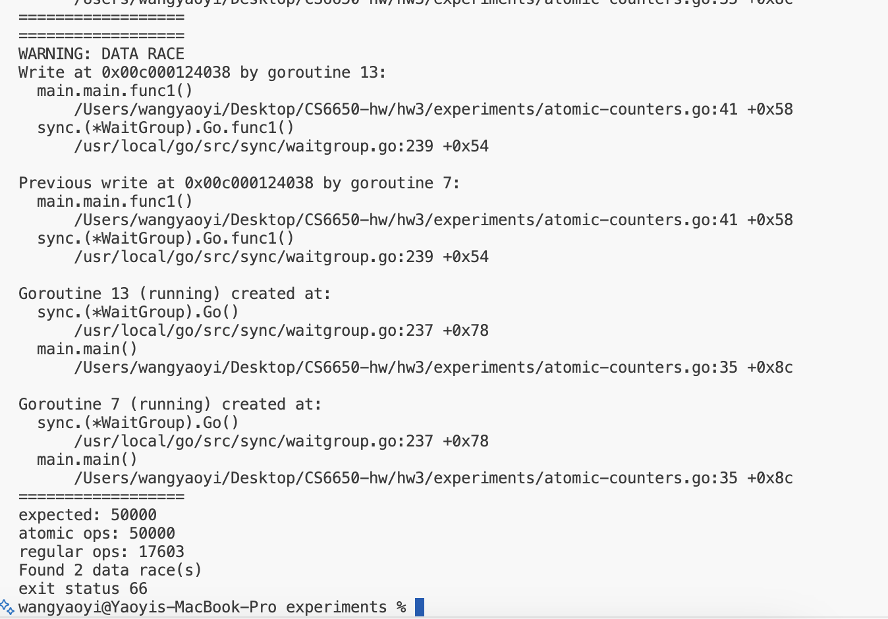

# Part II: Thread Experiments Report

## 1. Atomicity

### Concept
In concurrent programming, a **race condition** occurs when multiple threads access shared data simultaneously, and at least one of them modifies it. The `++` operation is not atomic - it consists of three steps: read, increment, and write. When multiple goroutines execute this simultaneously, updates can be lost.

**Atomic operations** guarantee that the read-modify-write sequence happens as a single, indivisible operation, preventing race conditions.

### Experiment
I compared two counters incremented by 50 goroutines, each running 1000 iterations:
- `atomic.Uint64` using `ops.Add(1)`
- Regular `uint64` using `regularOps++`

### Results

**Without -race flag:**



| Counter | Result | Expected | Correct? |
|---------|--------|----------|----------|
| atomic ops | 50000 | 50000 | ✅ |
| regular ops | 12527 | 50000 | ❌ Lost ~75% |

**With -race flag:**

```bash
go run -race atomic-counters.go
```



The race detector identified 2 data races at line 41 (`regularOps++`):
1. **Read-Write conflict:** Goroutine 13 reading while Goroutine 7 writing
2. **Write-Write conflict:** Both goroutines writing simultaneously

### Lesson Learned
Regular increment operations are **not thread-safe**. In a concurrent environment, shared variables must be protected using either atomic operations (`sync/atomic`) or locks (`sync.Mutex`) to prevent data loss from race conditions.

---

## 2. Collections

(TODO)

---

## 3. Mutex

(TODO)

---

## 4. RWMutex

(TODO)

---

## 5. Sync.Map

(TODO)

---

## 6. File Access

(TODO)

---

## 7. Context Switching

(TODO)