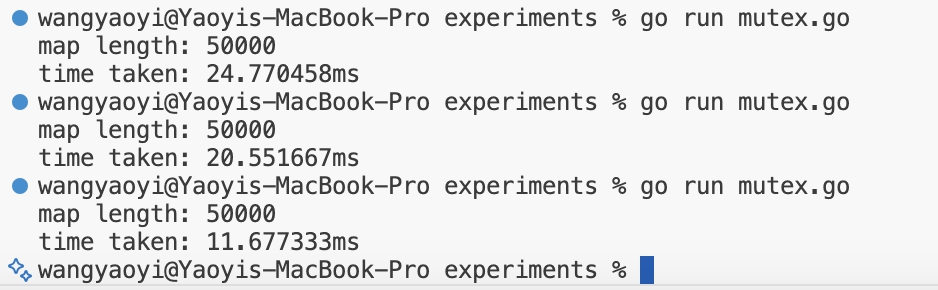
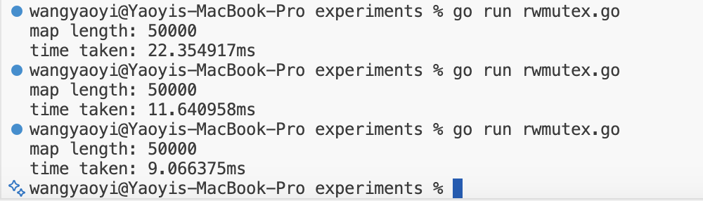
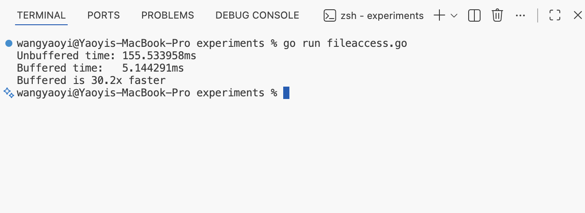
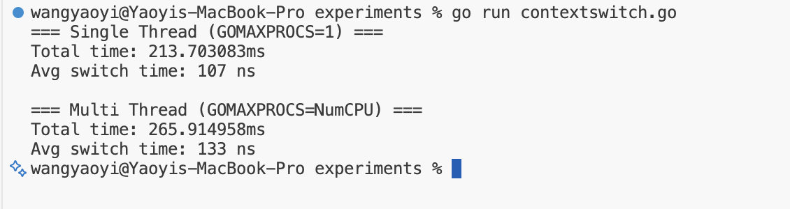

# Part II: Thread Experiments Report

## 1. Atomicity

### Concept
In concurrent programming, a **race condition** occurs when multiple threads access shared data simultaneously, and at least one of them modifies it. The `++` operation is not atomic—it consists of three steps: read, increment, and write. When multiple goroutines execute this simultaneously, updates can be lost.

**Atomic operations** guarantee that the read-modify-write sequence happens as a single, indivisible operation, preventing race conditions.

### Experiment
I compared two counters incremented by 50 goroutines, each running 1000 iterations:
- `atomic.Uint64` using `ops.Add(1)`
- Regular `uint64` using `regularOps++`

### Results

**Without -race flag:**


| Counter | Result | Expected | Correct? |
|---------|--------|----------|----------|
| atomic ops | 50000 | 50000 | ✅ |
| regular ops | 12527 | 50000 | ❌ Lost ~75% |

**With -race flag:**

```bash
go run -race atomic-counters.go
```


The race detector identified 2 data races at line 41 (`regularOps++`):
1. **Read-Write conflict:** Goroutine 13 reading while Goroutine 7 writing
2. **Write-Write conflict:** Both goroutines writing simultaneously

### Lesson Learned
Regular increment operations are **not thread-safe**. In a concurrent environment, shared variables must be protected using either atomic operations (`sync/atomic`) or locks (`sync.Mutex`) to prevent data loss from race conditions.

---

## 2. Collections

### Concept
Go's built-in `map` is **not thread-safe**. Unlike a simple integer (which just loses data during race conditions), a map is a complex data structure (hash table) with internal pointers, buckets, and metadata. When multiple goroutines write simultaneously, it can trigger rehashing and corrupt the internal structure. Go detects this and **crashes immediately** with `fatal error: concurrent map writes` — this is a deliberate "fail fast" design to prevent silent data corruption.

### Experiment
I spawned 50 goroutines, each writing 1000 distinct key-value pairs to a shared `map[int]int`.

### Results


```
fatal error: concurrent map writes
```

The program crashed because multiple goroutines attempted to write to the map simultaneously, corrupting its internal structure.

### Lesson Learned
Plain maps cannot be used safely in concurrent code. We need synchronization mechanisms (Mutex, RWMutex) or thread-safe alternatives (sync.Map).

---

## 3. Mutex

### Concept
A **Mutex (Mutual Exclusion)** is a lock that ensures only one goroutine can access the critical section at a time. Before accessing shared data, a goroutine must acquire the lock (`Lock()`), and release it after (`Unlock()`).

### Experiment
I wrapped the map in a struct with a `sync.Mutex`, locking before each write operation.

### Results



| Run | Time |
|-----|------|
| 1 | 24.77ms |
| 2 | 20.55ms |
| 3 | 11.68ms |
| **Mean** | **19.0ms** |

- Map length: 50000 ✅ (correct, no data loss)

### Lesson Learned
Mutex ensures correctness by preventing concurrent access, but it comes with performance overhead since all goroutines must wait for the lock.

---

## 4. RWMutex

### Concept
A **RWMutex (Read-Write Mutex)** allows multiple readers to access data simultaneously, but writers still need exclusive access. This is more efficient when reads dominate over writes.

### Experiment
I replaced `sync.Mutex` with `sync.RWMutex`. Since our experiment only does writes, we still use `Lock()`/`Unlock()` (not `RLock()`/`RUnlock()`).

### Results



| Run | Time |
|-----|------|
| 1 | 22.35ms |
| 2 | 11.64ms |
| 3 | 9.07ms |
| **Mean** | **14.4ms** |

- Map length: 50000 ✅

### Lesson Learned
RWMutex performs similarly to Mutex in write-heavy scenarios. Its advantage only shows when **reads dominate** — multiple goroutines can read concurrently without blocking each other.

---

## 5. Sync.Map

### Concept
`sync.Map` is Go's built-in concurrent-safe map. It uses internal optimizations (read-write separation, reduced lock contention) to achieve better performance in concurrent scenarios. The API is different: `Store()` instead of `m[key] = value`, and `Range()` to iterate.

### Experiment
I replaced the plain map with `sync.Map`, using `m.Store(key, value)` for writes.

### Results


| Run | Time |
|-----|------|
| 1 | 7.21ms |
| 2 | 5.48ms |
| 3 | 4.00ms |
| **Mean** | **5.6ms** |

- Map length: 50000 ✅

### Lesson Learned
Sync.Map is the fastest option for concurrent map access, but has tradeoffs: different API, no `len()` function, and values are typed as `any` (requires type assertion).

---

## Collections Comparison Summary

| Method | Result | Mean Time | Notes |
|--------|--------|-----------|-------|
| Plain map | ❌ crash | - | Not thread-safe |
| Mutex | ✅ 50000 | 19.0ms | Simple, full control |
| RWMutex | ✅ 50000 | 14.4ms | Better for read-heavy |
| Sync.Map | ✅ 50000 | 5.6ms | Fastest, different API |

### Quantitative Comparison

**Performance Chart (Mean Time in ms, lower is better):**

```
Mutex     ████████████████████ 19.0ms
RWMutex   ███████████████      14.4ms
Sync.Map  ██████               5.6ms
```

**Speedup relative to Mutex:**
| Method | Mean Time | Speedup |
|--------|-----------|---------|
| Mutex | 19.0ms | 1.0x (baseline) |
| RWMutex | 14.4ms | 1.3x faster |
| Sync.Map | 5.6ms | 3.4x faster |

### Tradeoffs

| Method | Pros | Cons | Best Use Case |
|--------|------|------|---------------|
| **Mutex** | Simple API, predictable, full control | All operations block each other | Simple cases, small critical sections |
| **RWMutex** | Concurrent reads, good for read-heavy | No benefit for write-heavy workloads | Read-heavy scenarios (caches, configs) |
| **Sync.Map** | Fastest, no manual locking | Different API, no `len()`, `any` type | High concurrency, stable key sets |

### What if read operations dominate?

In our experiment, we only performed **writes**, so RWMutex showed minimal improvement over Mutex. However, in a **read-heavy scenario** (e.g., 90% reads, 10% writes):

| Method | Write-Heavy (our test) | Read-Heavy (predicted) |
|--------|------------------------|------------------------|
| Mutex | Baseline | Baseline |
| RWMutex | ~1.3x faster | **Much faster** (reads don't block each other) |
| Sync.Map | ~3.4x faster | Still fast (optimized for reads) |

**Real-world examples:**
- **Write-heavy**: Logging systems, event streaming → Sync.Map or Mutex
- **Read-heavy**: Configuration stores, caches → RWMutex shines here

---

## 6. File Access

### Concept
Every `f.Write()` call is a **system call** that switches from user mode to kernel mode, asking the OS to write to disk. This is expensive. **Buffered I/O** reduces this cost by collecting writes in memory and flushing to disk in larger batches.

### Experiment
I compared two approaches writing 100,000 lines to a file:
- **Unbuffered**: `f.Write()` on each iteration (100,000 system calls)
- **Buffered**: `bufio.Writer` collects writes, then `Flush()` once (few system calls)

### Results



| Mode | Time | System Calls |
|------|------|--------------|
| Unbuffered | 155.5ms | ~100,000 |
| Buffered | 5.1ms | ~few dozen |
| **Speedup** | **30.2x** | - |

### Lesson Learned
I/O operations are expensive. Always use buffered I/O when possible to reduce system call overhead.

---

## 7. Context Switching

### Concept
**Context switching** is when the CPU stops executing one task and switches to another. This requires saving/restoring state and takes time. Goroutines are lightweight threads managed by Go runtime, which can switch faster than OS threads.

### Experiment
Two goroutines ping-pong a message 1,000,000 times. I measured the average switch time in two modes:
- **Single thread (GOMAXPROCS=1)**: All goroutines on one OS thread
- **Multi thread (GOMAXPROCS=NumCPU)**: Goroutines can use multiple OS threads

### Results



| Mode | Total Time | Avg Switch Time |
|------|------------|-----------------|
| Single Thread | 213.7ms | 107 ns |
| Multi Thread | 265.9ms | 133 ns |

**Single thread is ~24% faster!**

### Why is single thread faster?

| Mode | What happens |
|------|--------------|
| Single thread | Goroutines switch within Go runtime (user-space, very fast) |
| Multi thread | May involve OS thread switching (kernel-space, slower) |

### Context Switching Cost Comparison

| Execution Unit | Typical Cost | Why |
|----------------|--------------|-----|
| Goroutine | ~100 ns | User-level, same memory |
| Thread | ~1-10 μs | Kernel involvement |
| Process | ~10-100 μs | Separate address spaces |
| Container | ~Process | Process + isolation |
| VM | 100s of μs+ | Hypervisor + virtual hardware |
| RPC | ~ms | Network + serialization |

### Lesson Learned
Goroutines are extremely lightweight compared to OS threads. This is why Go can handle hundreds of thousands of concurrent goroutines while Java struggles with a few thousand threads.