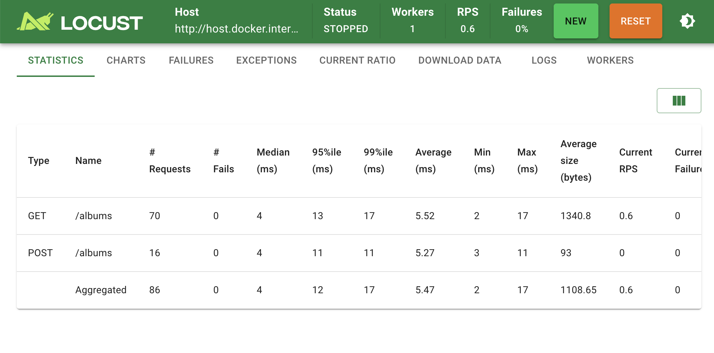
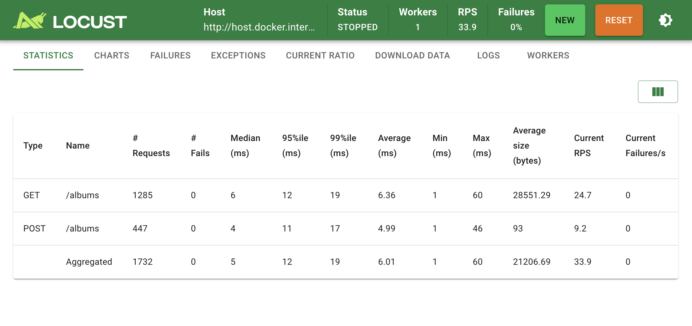
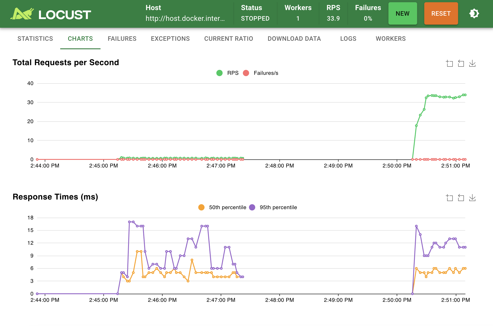
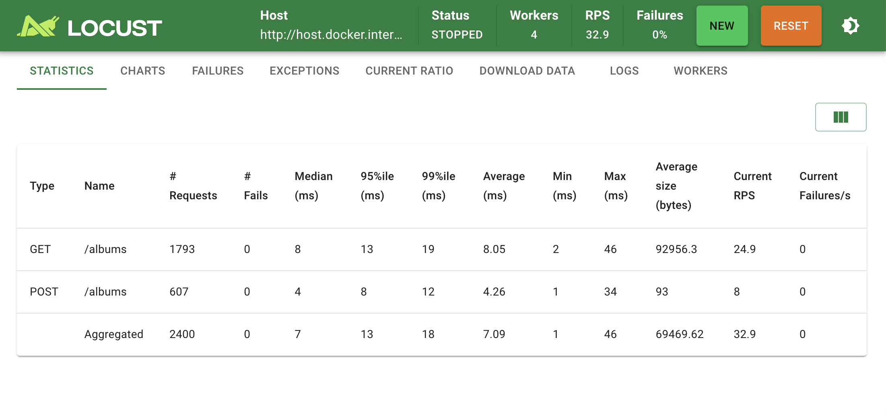
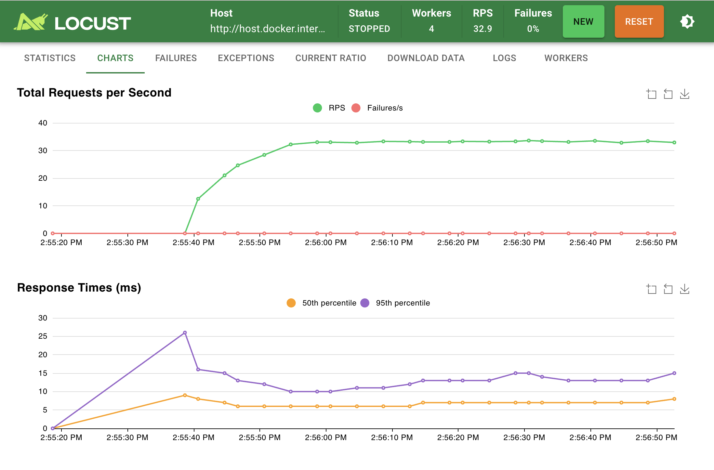
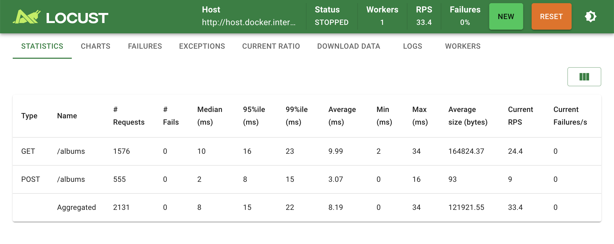
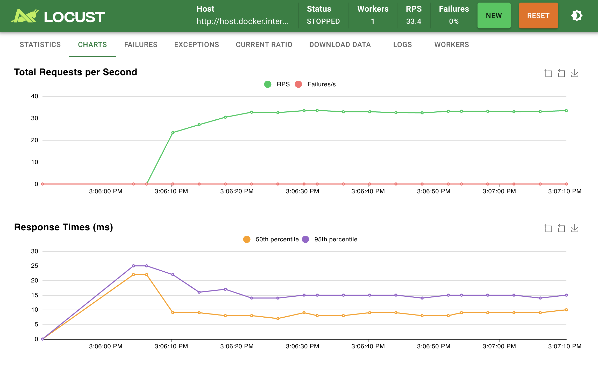

# Part III: Load Testing with Locust

## Overview

Locust is a load testing tool written in Python using "green threads" (user-level threads). In this experiment, I used Locust to load test a Go server (from HW1) that provides a simple REST API for managing albums.

**Server Endpoints:**
- `GET /albums` - Get all albums
- `POST /albums` - Add a new album

**Test Configuration:**
- GET:POST ratio = 3:1
- 50 users
- 10 users/second ramp up

---

## Setup

### Start Go Server

```bash
cd hw1a
go run main.go
```

### Start Locust with Docker Compose

**1 Worker:**
```bash
cd hw3/locust
docker-compose up --scale worker=1
```

**4 Workers:**
```bash
docker-compose up --scale worker=4
```

Then access Locust Web UI at `http://localhost:8089`

### docker-compose.yml

```yaml
version: '3'

services:
  master:
    image: locustio/locust
    ports:
      - "8089:8089"
    volumes:
      - ./locustfile.py:/mnt/locust/locustfile.py
    command: -f /mnt/locust/locustfile.py --master -H http://host.docker.internal:8080

  worker:
    image: locustio/locust
    volumes:
      - ./locustfile.py:/mnt/locust/locustfile.py
    command: -f /mnt/locust/locustfile.py --worker --master-host master
```

### locustfile.py (HttpUser)

```python
from locust import HttpUser, task, between

class AlbumUser(HttpUser):
    wait_time = between(1, 2)

    @task(3)  # Weight 3 - GET runs 3x more often than POST
    def get_albums(self):
        self.client.get("/albums")

    @task(1)  # Weight 1
    def post_album(self):
        self.client.post("/albums", json={
            "id": "99",
            "title": "Test Album",
            "artist": "Test Artist",
            "price": 9.99
        })
```

### locustfile.py (FastHttpUser)

```python
from locust import task, between
from locust.contrib.fasthttp import FastHttpUser

class AlbumUser(FastHttpUser):
    wait_time = between(1, 2)

    @task(3)
    def get_albums(self):
        self.client.get("/albums")

    @task(1)
    def post_album(self):
        self.client.post("/albums", json={
            "id": "99",
            "title": "Test Album",
            "artist": "Test Artist",
            "price": 9.99
        })
```

---

## Initial Test (1 Worker, 1 User)



Initial test to verify setup is working correctly. No failures observed.

---

## Local Test (1 Worker, 50 Users)





| Type | Requests | Avg (ms) | RPS |
|------|----------|----------|-----|
| GET | 1285 | 6.36 | 24.7 |
| POST | 447 | 4.99 | 9.2 |
| **Total** | 1732 | 6.01 | **33.9** |

- **Failures: 0%**
- **GET:POST ratio**: 1285:447 ≈ 2.9:1 (matches our 3:1 configuration)

### Observations
- GET requests have larger response size (~28KB) because they return all albums
- POST requests have smaller response size (93 bytes) because they only return the created album
- Response times are similar (~5-6ms) for both operations

---

## Amdahl's Law (4 Workers)





| Type | Requests | Avg (ms) | RPS |
|------|----------|----------|-----|
| GET | 1793 | 8.05 | 24.9 |
| POST | 607 | 4.26 | 8 |
| **Total** | 2400 | 7.09 | **32.9** |

### Comparison: 1 Worker vs 4 Workers

| Workers | RPS | Speedup |
|---------|-----|---------|
| 1 | 33.9 | 1.0x |
| 4 | 32.9 | 0.97x |

**No improvement** Adding 4x workers did not increase throughput.

### Why? Amdahl's Law

The bottleneck is the **Go server**, not Locust workers.

```
Amdahl's Law: Speedup = 1 / (S + P/N)

S = Serial portion (server processing) - THIS IS THE BOTTLENECK
P = Parallel portion (sending requests)
N = Number of workers
```

When the serial portion (S) dominates, adding more parallel resources (N) has no effect. Our Go server can only handle ~33 RPS regardless of how many Locust workers we use.

---

## Context Switching (FastHttpUser)

By default, Locust uses `python-requests` which is pure Python. `FastHttpUser` uses a C-based HTTP client designed for higher concurrency.





| Type | Requests | Avg (ms) | RPS |
|------|----------|----------|-----|
| GET | 1576 | 9.99 | 24.4 |
| POST | 555 | 3.07 | 9 |
| **Total** | 2131 | 8.19 | **33.4** |

### Comparison: HttpUser vs FastHttpUser

| Client | RPS |
|--------|-----|
| HttpUser (Python) | 33.9 |
| FastHttpUser (C-based) | 33.4 |

**Still no improvement** The bottleneck remains the server, not the HTTP client.

FastHttpUser would show benefits in scenarios where:
- The server can handle very high throughput (10,000+ RPS)
- Locust needs to simulate many more concurrent users
- CPU usage on the Locust machine becomes the limiting factor

---

## Summary

| Experiment | Config | RPS | Observation |
|------------|--------|-----|-------------|
| Local Test | 1 worker, HttpUser | 33.9 | Baseline |
| Amdahl's Law | 4 workers, HttpUser | 32.9 | No improvement |
| FastHttpUser | 1 worker, FastHttpUser | 33.4 | No improvement |

### Lessons Learned

1. **Amdahl's Law in Practice**: Adding more client-side resources (workers, faster HTTP libraries) does not improve throughput when the server is the bottleneck.

2. **Identify the Bottleneck**: Before scaling horizontally, identify where the bottleneck actually is. In our case, it's the single Go server instance.

3. **GET vs POST Performance**: Both operations had similar latency (~5-8ms), but GET returns more data. In real-world scenarios with database operations, POST (write) operations are typically slower due to disk I/O and consistency requirements.

4. **To improve throughput**, we would need to:
   - Scale the server horizontally (multiple instances)
   - Add a load balancer
   - Optimize server-side code
   - Use connection pooling or caching