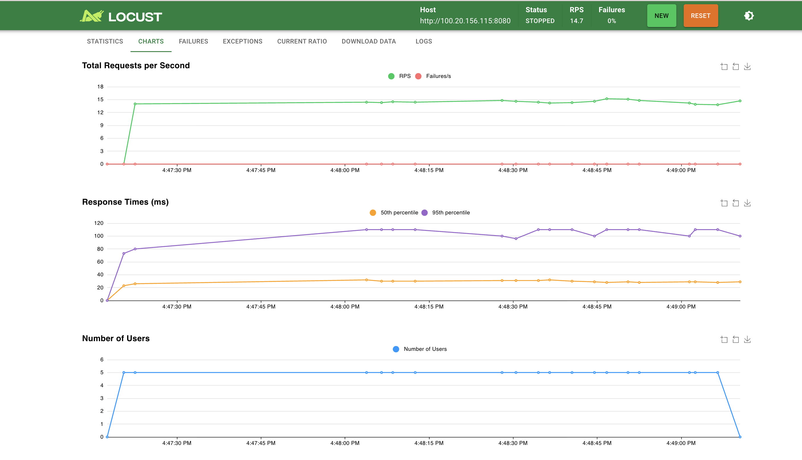
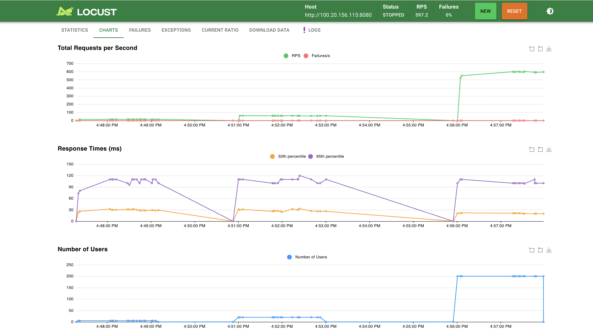
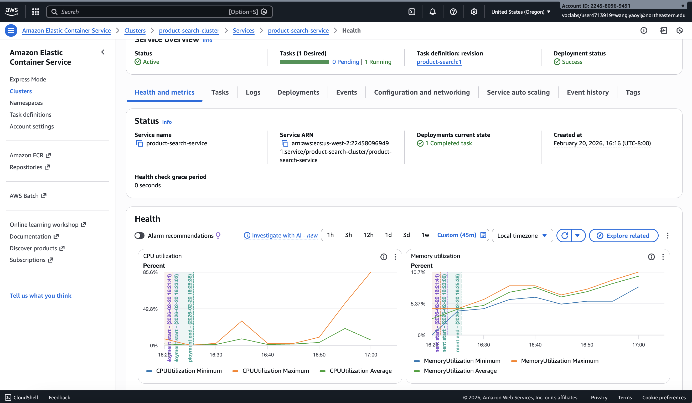
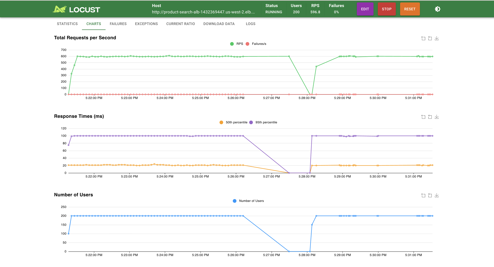
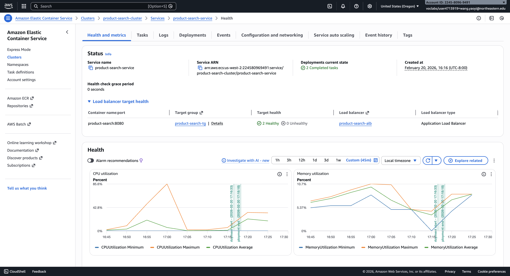

# HW6 Report: Identifying Performance Bottlenecks & Horizontal Scaling

## Part II: Identifying Performance Bottlenecks

### Setup
- **Service:** Go product search service with 100,000 products in memory (sync.Map)
- **Search logic:** Each request checks exactly 100 products, returns max 20 results
- **Infrastructure:** ECS Fargate, 256 CPU units (0.25 vCPU), 512 MB memory, 1 instance

### Load Testing Results

| Test | Users | RPS | Median (ms) | 95th (ms) | CPU | Memory | Failures |
|------|-------|-----|-------------|-----------|-----|--------|----------|
| Baseline | 5 | 14.7 | 30 | 110 | ~28% | ~8% | 0% |
| Medium | 20 | 58.8 | 29 | 110 | ~28% | ~8% | 0% |
| High | 200 | 597 | ~20 | ~100 | ~49% | ~9% | 0% |
| Breaking Point | 500 (short burst) | - | - | - | ~85.6% | ~10% | - |

#### Baseline Test (5 Users, 2 min)

#### Breaking Point Test (200 Users, 3 min)

#### CloudWatch CPU & Memory — Single Instance

The chart below shows CPU rising from ~28% (5-20 users) to ~49% (200 users) and peaking at ~85.6% during a short 500-user burst. Memory remains steady at ~8-10% throughout.

### Analysis

**Which resource hits the limit first?**
CPU is the bottleneck. As user count increased from 5 to 500, CPU rose from 28% to 85.6%, while memory remained stable at ~8-10%. This is expected because each search performs CPU-bound string matching across 100 products, whereas memory usage is fixed (products loaded once at startup).

**How much did response times degrade?**
Response times remained relatively stable across 5, 20, and 200 users (median ~20-30ms, 95th ~100-110ms). The Go service handled up to ~600 RPS efficiently even on 0.25 vCPU. Degradation would become significant beyond 500 concurrent users as CPU approaches 100%.

**Could you solve this by doubling CPU (256 → 512 units)?**
Yes, vertical scaling to 512 CPU units would approximately double the throughput capacity. However, this approach has limits — you can only scale up so far before hitting maximum instance sizes. Horizontal scaling (Part III) provides a more sustainable solution.

**Key Lesson:**
When the computation per request is fixed (checking exactly 100 products), you cannot optimize the algorithm further. The solution is more compute power — either vertically (bigger instances) or horizontally (more instances).

---

## Part III: Horizontal Scaling with Auto Scaling

### Setup
- **Same Go service** as Part II (unchanged code)
- **ALB:** Application Load Balancer distributing traffic across instances on port 80
- **Target Group:** Health checks on `/health` every 30 seconds
- **Auto Scaling:** Target 70% CPU, min 2 instances, max 4 instances, 300s cooldown
- **ECS Service:** 2 desired tasks (Fargate, 256 CPU / 512 MB each)

### Core Test + Resilience Test (200 Users, 5 min)

I ran the same 200-user load test through the ALB. During the test, I manually stopped one ECS task to test resilience.

**Observations from the chart above:**
- **Before the stop (~5:21-5:27):** Stable ~600 RPS, median ~20ms, 0% failures across 2 instances
- **Instance stopped (~5:27):** RPS dropped temporarily as one instance went offline
- **Recovery (~5:28-5:29):** ECS automatically launched a replacement task; RPS recovered to ~600
- **Failures: 0%** — the ALB routed all traffic to the remaining healthy instance during the disruption

#### CloudWatch CPU & Memory — Horizontal Scaling

CPU utilization per instance is lower compared to Part II because the load is distributed across 2 healthy targets. Memory remains stable at ~10%.

### Component Roles

- **ALB (Application Load Balancer):** Distributes incoming requests across all healthy ECS tasks, providing a single DNS endpoint for clients
- **Target Group:** Monitors instance health via `/health` endpoint; unhealthy instances are automatically removed from rotation
- **Auto Scaling:** Monitors average CPU utilization and adjusts the number of ECS tasks between 2-4 based on the 70% CPU target

### Vertical vs Horizontal Scaling Trade-offs

| Aspect | Vertical Scaling | Horizontal Scaling |
|--------|-----------------|-------------------|
| Approach | Bigger instance (more CPU/memory) | More instances |
| Fault tolerance | Single point of failure | Survives instance failures |
| Cost efficiency | Pay for peak capacity always | Scale in when load decreases |
| Complexity | Simple (just resize) | More complex (ALB, health checks, auto scaling) |
| Limits | Hardware maximums | Nearly unlimited |

### Prediction: Scaling Behavior for Different Load Patterns

- **Gradual increase:** Auto scaling smoothly adds instances as CPU crosses 70%, with 300s cooldown preventing oscillation
- **Sudden spike:** Initial instances absorb the spike; new instances take 1-2 minutes to launch, causing temporary latency increase
- **Periodic bursts:** Scale-out handles peaks; scale-in cooldown prevents premature removal during quiet periods