# HW7 Report: Synchronous vs Asynchronous Order Processing


> **TODO: Combine team results**

> See the shared Google Sheet for group results: [Group Results Sheet](https://docs.google.com/spreadsheets/d/1vUnhPHcGvaPlH1ZLdVgcAKUMGENw_JBaKoSgbAcoZnw/edit?usp=sharing)
---

## Part I: Vector Clocks

*(See Piazza post under "vectorclocks")*

---

## Part II: Synchronous vs Asynchronous Order Processing

### Architecture

```
Sync:   Client → ALB → order-receiver → 3s payment delay → 200 OK

Async:  Client → ALB → order-receiver → SNS → 202 Accepted
                                          ↓
                                     SQS Queue
                                          ↓
                                   order-processor (goroutine workers) → 3s delay
```

Infrastructure deployed with Terraform:
- VPC with public subnets (ALB) and private subnets (ECS) with NAT Gateway
- ECS Fargate cluster with two services: order-receiver and order-processor
- SNS topic (`order-processing-events`) → SQS queue (`order-processing-queue`)
- Application Load Balancer routing to order-receiver on port 8080

### Yaoyi's Results

#### Phase 1: Sync — Normal Load (5 users, 30s)

| Metric | Value |
|--------|-------|
| RPS | 0.4 |
| Avg Response Time | 12,487ms |
| Total Requests | 17 |
| Failure Rate | 0% |

With only 5 concurrent users, response times already reach 12–15 seconds due to the single payment slot bottleneck. The system handles all requests, but customers wait an unacceptable amount of time.

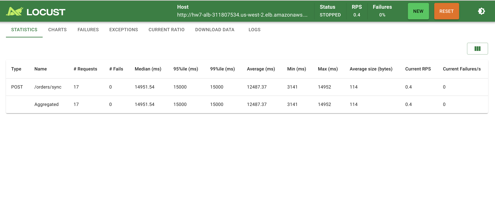

#### Phase 2: Sync — Flash Sale (20 users, 60s)

| Metric | Value |
|--------|-------|
| RPS | 0.33 |
| Avg Response Time | 41,309ms |
| Max Response Time | 59,951ms |
| Total Requests | 31 |
| Failure Rate | 0% |

Throughput remains locked at 0.33/s regardless of user count — the payment slot is the hard ceiling. Average response time nearly quadruples to 41 seconds, with some customers waiting a full minute.

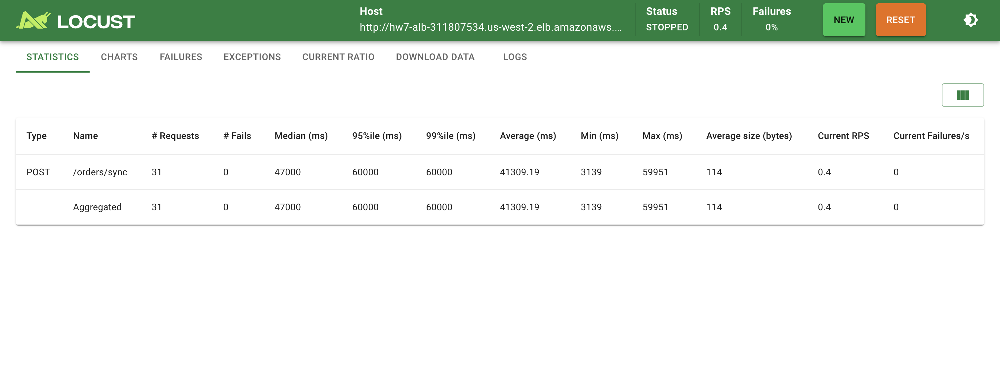
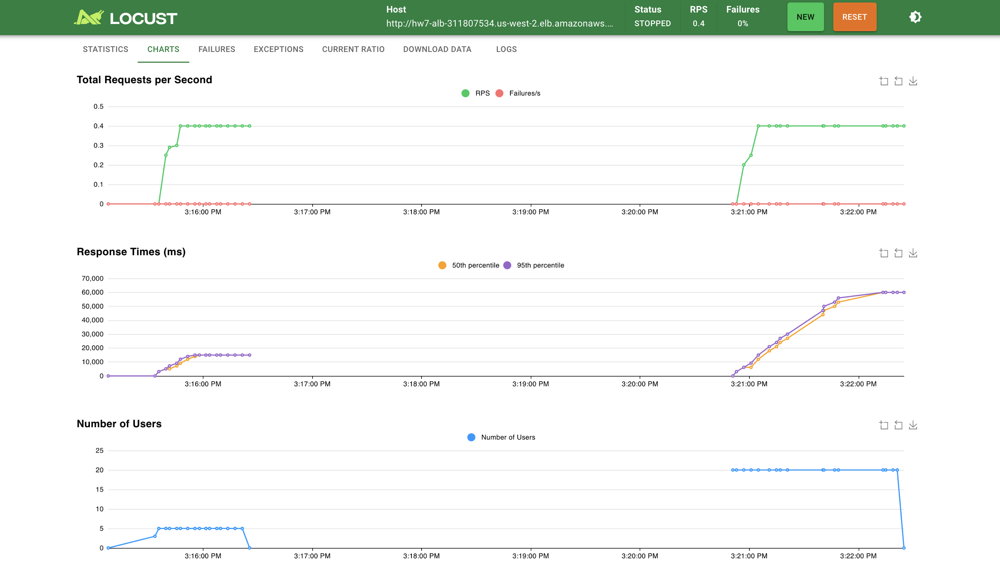

#### Bottleneck Analysis (Phase 2)

- Payment processor capacity: 1 order / 3 seconds = **0.33 orders/second**
- Flash sale demand: ~60 orders/second
- Orders lost per second: 60 − 0.33 = **~59.67/second**
- The bottleneck is the payment processor speed, which we cannot change. What we *can* change is how we handle the wait — by decoupling acceptance from processing.

#### Phase 3: Async — Flash Sale (20 users, 1 worker, 60s)

| Metric | Value |
|--------|-------|
| RPS | 59.3 |
| Avg Response Time | 36ms |
| Total Requests | 3,282 |
| Failure Rate | 0% |

By publishing orders to SNS and immediately returning 202 Accepted, the API handles the full flash sale load. Compared to sync: **~106x more orders accepted**, response time drops from 41 seconds to 36 milliseconds.

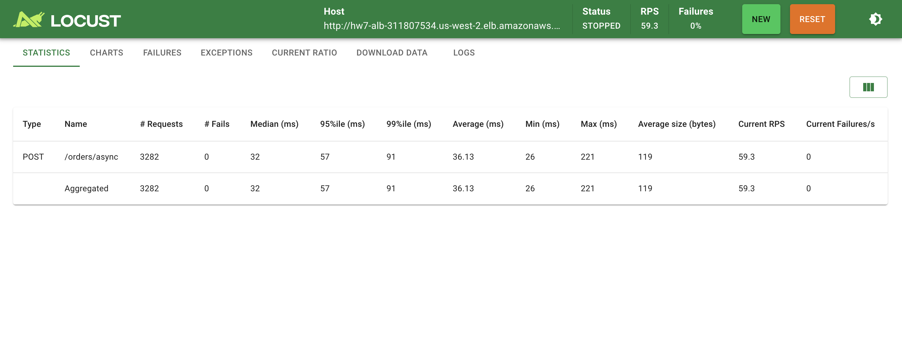

#### Phase 4: Queue Buildup

With 1 worker processing at 0.33/s and orders arriving at ~60/s, the queue grows at ~59.67 messages/second. After the 60-second flash sale, approximately 3,150 messages are backlogged.

Time to clear backlog with 1 worker: 3,150 × 3s = **~158 minutes (2.6 hours)**.

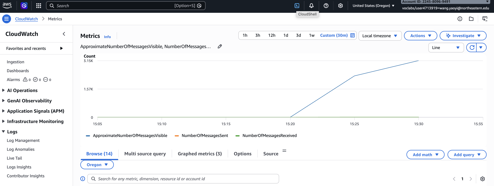

#### Phase 5: Worker Scaling

All tests: 20 users, spawn rate 10, 60 seconds.

| Workers | Processing Rate | Queue Growth Rate | Prevents Buildup? |
|---------|----------------|-------------------|-------------------|
| 1 | 0.33/s | ~59.67/s | No |
| 5 | 1.67/s | ~58.33/s | No |
| 20 | 6.67/s | ~53.33/s | No |
| 100 | 33.33/s | ~26.67/s | No |
| **180** | **60/s** | **0/s** | **Yes (minimum)** |

**Minimum workers to prevent queue buildup at 60 orders/second: 180** (60 orders/s × 3s/order).

The API-side performance remained consistent across all worker counts (~60 RPS, ~35ms avg), confirming that async fully decouples acceptance from processing.

| Workers | Locust Statistics | Locust Charts |
|---------|------------------|---------------|
| 5 | 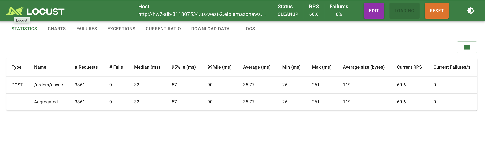 | 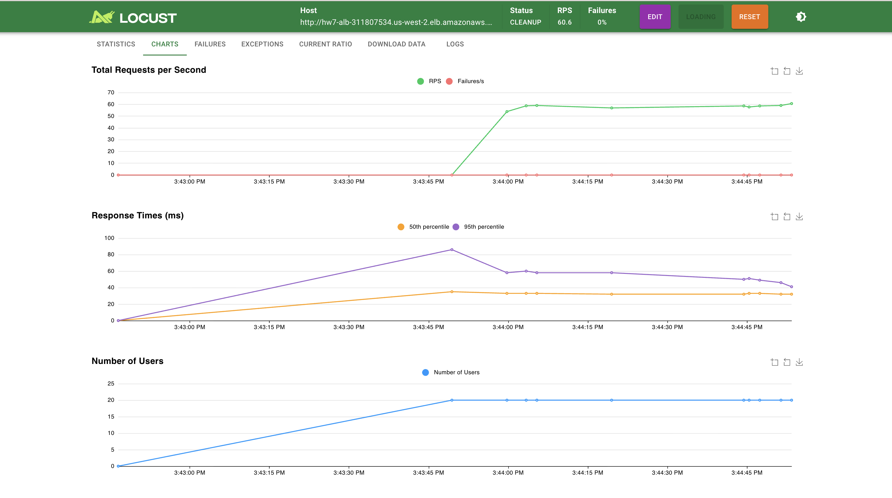 |
| 20 | 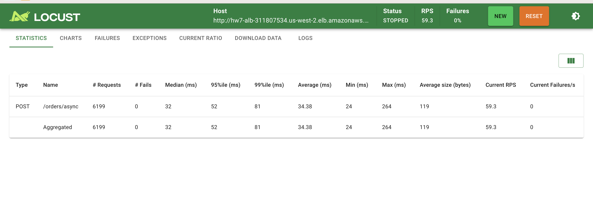 | 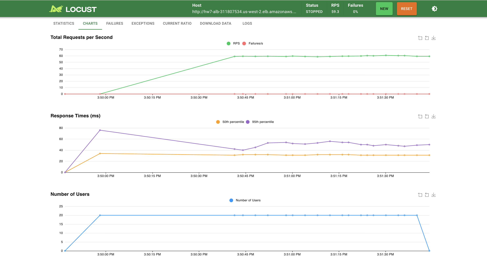 |
| 100 | 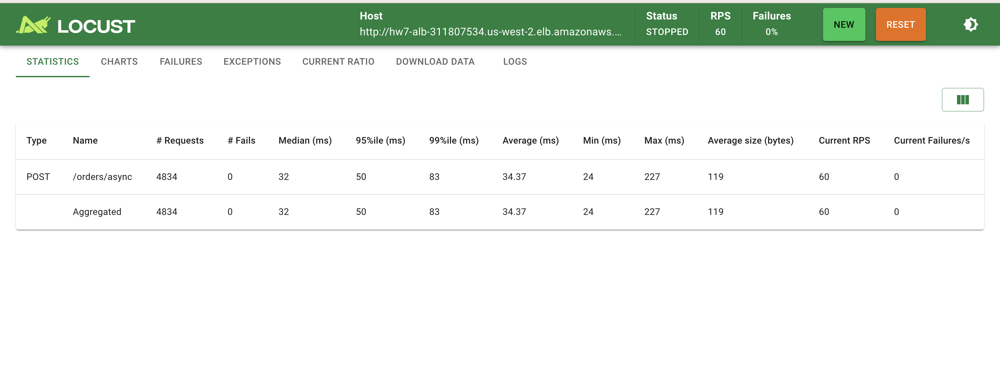 | 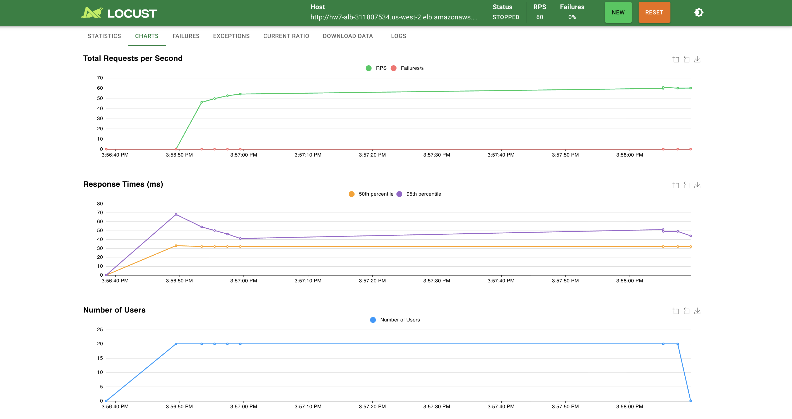 |

**CloudWatch Queue Depth — All Tests Overview:**

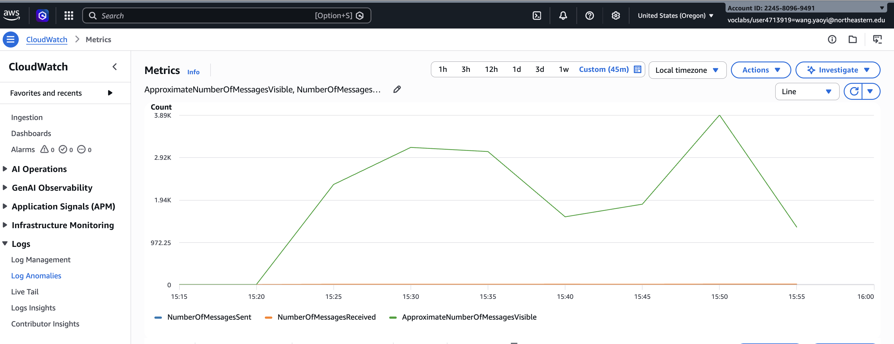

---

## Part III: Serverless (Lambda)

### Architecture

```
Client → ALB → order-receiver → SNS → Lambda (auto-scaled, 3s delay)
```

Deployed a Go Lambda function (provided.al2 runtime, 512MB memory) subscribed directly to the Part II SNS topic. No SQS queue needed.

### Yaoyi's Results

#### Cold Start Observations

Sent 10 test orders. Lambda automatically created 10 parallel instances (10 log streams).

From CloudWatch logs:

```
REPORT RequestId: f5833e1c-92bd-46ae-8ca8-1aa9c9b25374
  Duration: 3002.53 ms
  Billed Duration: 3073 ms
  Memory Size: 512 MB
  Max Memory Used: 20 MB
  Init Duration: 69.85 ms
```

- **Cold start (Init Duration): 69.85ms** — only 2.3% overhead on 3s processing
- Cold starts occur on first invocation and after ~5+ minutes idle
- For 3-second payment processing, this overhead is negligible

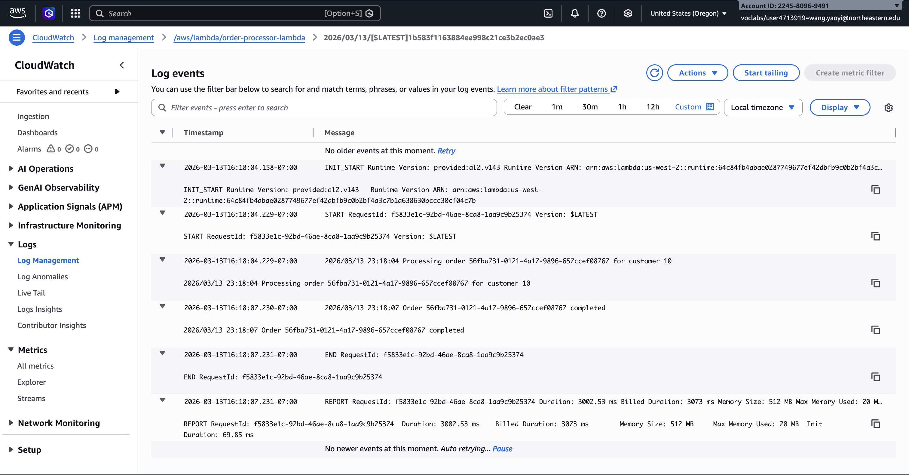

#### Cost Calculation

Assuming 10,000 orders/month at 3s each with 512MB (0.5GB):

| | ECS (Part II) | Lambda (Part III) |
|---|---|---|
| Monthly cost | $17 (2 tasks × $8.50) | **$0** (within free tier) |
| Break-even | Always $17 | Free until ~267K orders/month |
| Scaling | Manual (adjust workers) | Automatic |
| Queue management | Required (SQS) | Not needed |

Lambda free tier: 1M requests + 400K GB-seconds/month. For 3s/0.5GB orders: 400K ÷ 1.5 = ~267K orders FREE.

#### Switch Recommendation

Yes, the startup should switch to Lambda. The cost advantage is compelling — $0 vs $17/month for our expected volume, with Lambda remaining free until 267K orders/month. The cold start overhead of 70ms is negligible against 3-second payment processing (2.3%). Most importantly, Lambda eliminates all operational overhead: no queue depth monitoring, no worker scaling, no 3am alerts, no ECS health checks. The trade-off is losing SQS's delivery guarantees — SNS retries only twice before discarding — but for a startup prioritizing development velocity and cost efficiency, this is an acceptable risk. If reliability requirements grow or order volume exceeds the free tier, the ECS/SQS architecture from Part II provides a proven upgrade path.

---

## Analysis Questions

**How many times more orders did async accept vs sync?**
Async accepted ~106x more orders in 60 seconds (3,282 vs 31). In terms of RPS, async achieved 59.3 vs sync's 0.33.

**What causes queue buildup and how to prevent it?**
Queue buildup occurs when the ingestion rate exceeds the processing rate. With 60 orders/s arriving and 1 worker processing at 0.33/s, the queue grows at ~59.67 messages/second. Prevention requires scaling workers until processing capacity meets demand: 180 workers minimum for 60 orders/s at 3s each.

**When would you choose sync vs async in production?**
Use sync when processing is fast (<100ms) and immediate confirmation with result is required. Use async when processing is slow or unpredictable, you need to absorb traffic spikes, or you want to decouple services for independent scaling and fault isolation. The 3-second payment delay makes async the clear choice for any non-trivial load.

---

## Compare Across Mock Interview Group Members

> **TODO: Fill in after collecting all teammates' results**
>
> | Metric | Yaoyi | Member 2 | Member 3 |
> |--------|-------|----------|----------|
> | Sync RPS (20 users) | 0.33 | | |
> | Async RPS (20 users) | 59.3 | | |
> | Async Avg Response (ms) | 36 | | |
> | Queue Depth (1 worker) | ~3,150 | | |
> | Lambda Cold Start (ms) | 69.85 | | |
> | Lambda Memory Used (MB) | 20 | | |
> | Switch Recommendation | Yes | | |
>
> Discuss: Did all team members observe similar results? Any notable differences in RPS, queue behavior, or cold start times? What might explain the differences?