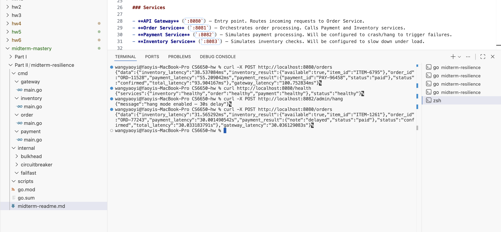
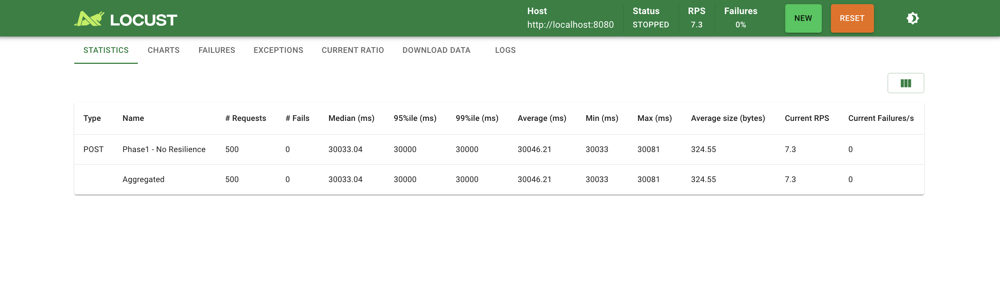
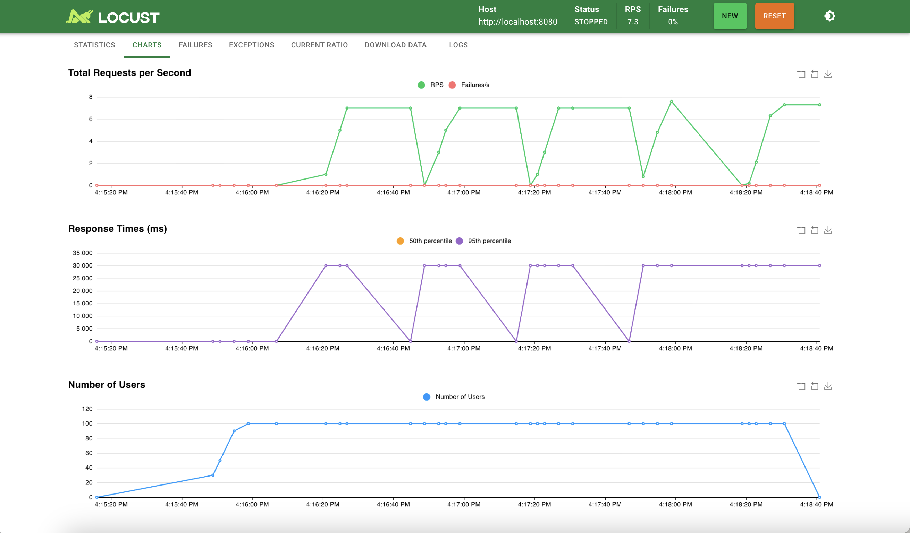
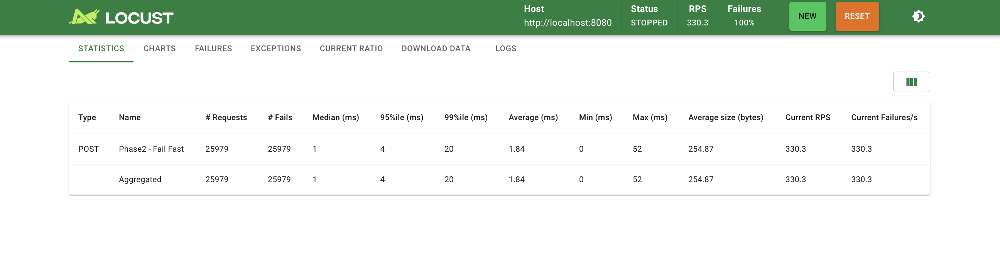
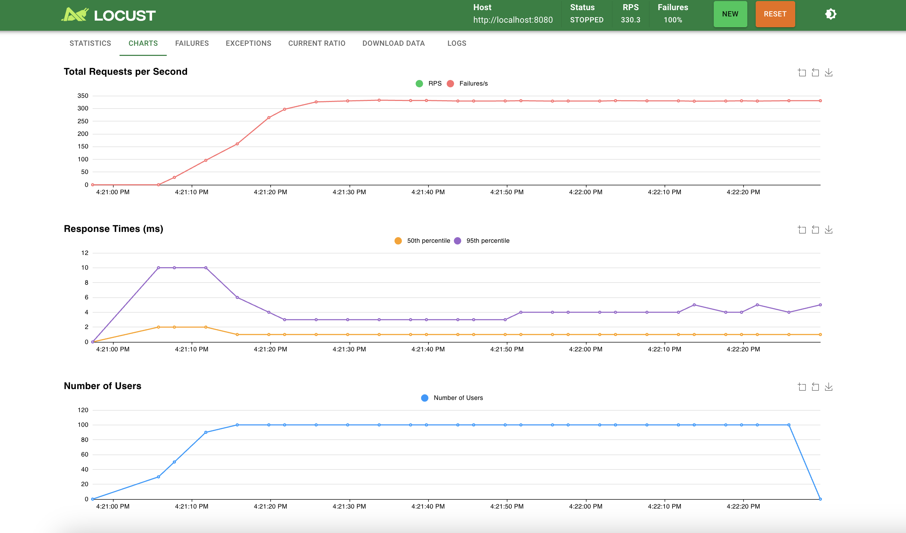
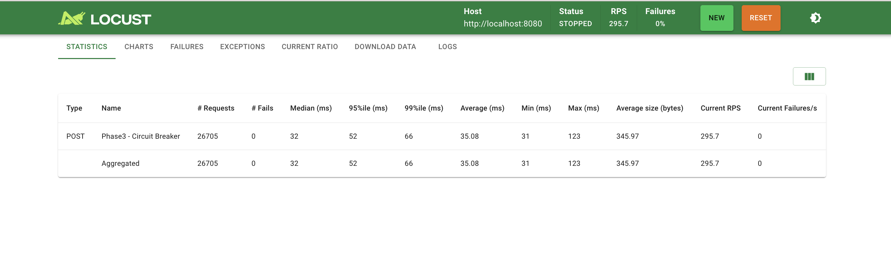
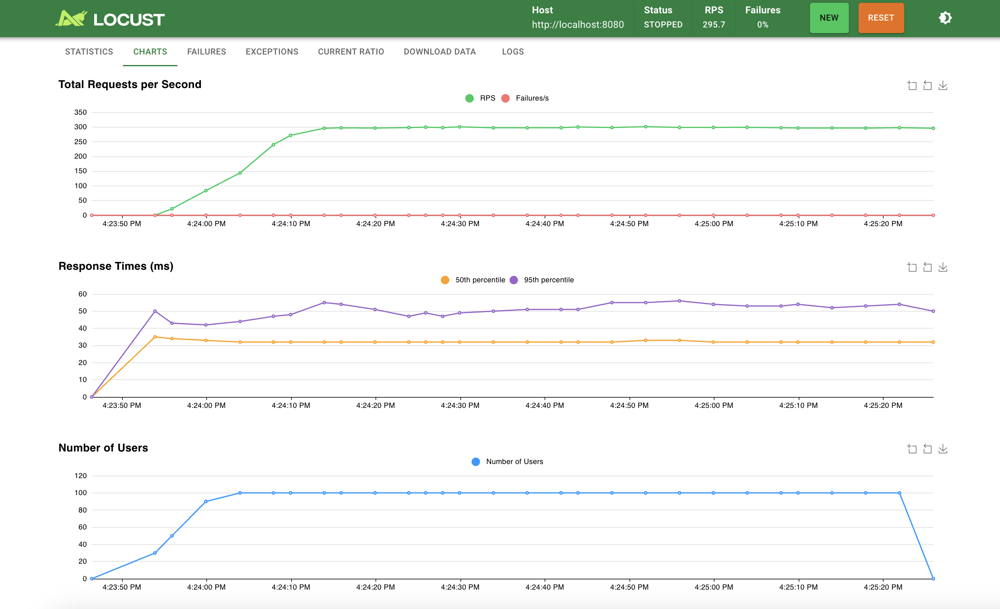
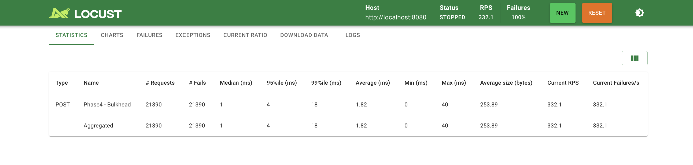
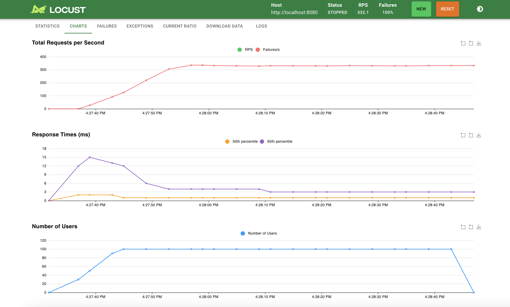
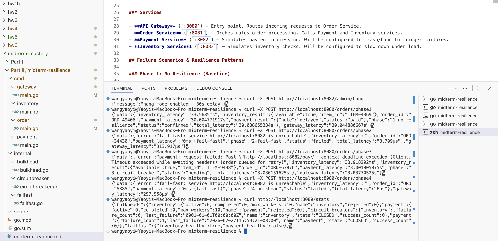

# Step III: Crashing and Recovering — Experiment Report

## 1. Introduction

This experiment demonstrates how a microservices system fails under cascading failures and how three resilience patterns — **Fail Fast**, **Circuit Breaker**, and **Bulkhead** — can be applied to recover gracefully. The system is built in Go using the Gin framework and tested with Locust under 100 concurrent users.

---

## 2. System Architecture

The system consists of four microservices:

```
   Locust ──▶ API Gateway (:8080) ──▶ Order Service (:8081)
                                          ├──▶ Payment Service (:8082)
                                          └──▶ Inventory Service (:8083)
```

- **API Gateway** — Routes requests to Order Service
- **Order Service** — Orchestrates order processing by calling Payment and Inventory
- **Payment Service** — Simulates payments; supports fault injection (hang, crash, flaky)
- **Inventory Service** — Simulates inventory checks

The Payment Service exposes admin endpoints (`/admin/hang`, `/admin/flaky`, `/admin/recover`) to inject faults on demand during testing.

---

## 3. The Problem: Cascading Failure (Phase 1)

### 3.1 Setup

Payment Service is set to **hang mode** (30-second delay per request). Order Service has a 35-second HTTP timeout with no resilience protection.

### 3.2 Manual Test

A single curl request demonstrates the problem — the entire request is blocked for 30 seconds:



- **Normal operation:** total latency ~100ms
- **With Payment hanging:** total latency **30.03 seconds**

### 3.3 Load Test Results (no resilience)





| Metric | Value |
|---|---|
| Median Latency | 30,033 ms |
| Throughput (RPS) | 7.3 |
| Total Requests | 500 |
| Failure Rate | 0% |

### 3.4 Analysis

Although the failure rate is technically 0% (requests eventually complete), the system is effectively unusable. Every request takes 30 seconds, throughput drops to just 7.3 RPS, and all 100 concurrent users are blocked waiting. A single failing downstream service has brought the entire system to its knees — this is a **cascading failure**.

---

## 4. The Fix: Resilience Patterns

### 4.1 Phase 2 — Fail Fast

**Concept:** A background health checker pings each downstream service every 2 seconds. If a service is detected as unhealthy, requests are rejected immediately (0ms latency) instead of waiting for a timeout.

**Implementation:** `internal/failfast/failfast.go` — runs a goroutine that periodically calls `/health` on each downstream service and maintains an in-memory healthy/unhealthy flag.





| Metric | Value |
|---|---|
| Median Latency | 1 ms |
| Throughput (RPS) | 330.3 |
| Total Requests | 25,979 |
| Failure Rate | 100% |

**Analysis:** Latency dropped from 30,033ms to **1ms** — a 30,000x improvement. Throughput increased from 7.3 to **330.3 RPS** (45x improvement). All requests fail (Payment is down), but they fail **instantly**, freeing resources for other operations. The system remains responsive.

---

### 4.2 Phase 3 — Circuit Breaker

**Concept:** Tracks consecutive failures to a downstream service. After 3 failures, the circuit "opens" and blocks all requests for a 10-second cooldown period. After cooldown, one probe request is allowed ("half-open") to test if the service has recovered.

**States:** Closed (normal) → Open (blocking) → Half-Open (probing) → Closed (recovered)

**Implementation:** `internal/circuitbreaker/circuitbreaker.go` — wraps downstream calls in an `Execute()` function that tracks failures and manages state transitions.

**Test Scenario:** Payment Service in **flaky mode** (50% random failure rate) — this is ideal for demonstrating circuit breaker behavior, as the service is intermittently failing rather than completely down.





| Metric | Value |
|---|---|
| Median Latency | 32 ms |
| Throughput (RPS) | 295.7 |
| Total Requests | 26,705 |
| Failure Rate | 0% |

**Analysis:** Under 50% flaky conditions, the system achieves **0% failure rate** as seen by Locust. This is because the circuit breaker returns HTTP 202 ("pending — order queued for retry") as a graceful fallback instead of a hard error. The system maintains high throughput (295.7 RPS) and stable latency. Inventory Service is completely unaffected throughout.

---

### 4.3 Phase 4 — Bulkhead + Circuit Breaker + Fail Fast (Combined)

**Concept:** All three patterns are layered together. Additionally, Payment and Inventory calls are isolated into separate **goroutine pools** (max 10 concurrent each) and executed **in parallel** using Go's goroutines and `sync.WaitGroup`.

**Implementation:** `internal/bulkhead/bulkhead.go` — uses a buffered channel as a semaphore to limit concurrent calls. If the pool is full, requests are rejected immediately.

**Layered defense:**
1. **Fail Fast** checks if Payment is reachable → rejects instantly if not
2. **Bulkhead** limits concurrent calls → prevents resource exhaustion
3. **Circuit Breaker** handles intermittent failures → graceful fallback





| Metric | Value |
|---|---|
| Median Latency | 1 ms |
| Throughput (RPS) | 332.1 |
| Total Requests | 21,390 |
| Failure Rate | 100% |

**Analysis:** Best overall performance with all three patterns combined. The 1ms median latency matches Phase 2 (Fail Fast catches the down service immediately), while the Bulkhead ensures that even if Fail Fast were to miss a failure, the Payment goroutine pool would not exhaust resources needed by Inventory. The parallel execution of both service calls also reduces latency when services are healthy.

---

## 5. All Phases Comparison

The following screenshot shows the curl output for all four phases side by side, along with the `/stats` endpoint showing the real-time state of all resilience components:



### Summary Table

| Phase | Median (ms) | p95 (ms) | RPS | Failure % | Key Behavior |
|---|---|---|---|---|---|
| 1 - No Resilience | 30,033 | 30,000 | 7.3 | 0% | System frozen for 30s per request |
| 2 - Fail Fast | 1 | 4 | 330.3 | 100% | Instant rejection, 45x throughput gain |
| 3 - Circuit Breaker | 32 | 52 | 295.7 | 0% | Graceful degradation under flaky conditions |
| 4 - Bulkhead + All | 1 | 4 | 332.1 | 100% | Full isolation + parallel execution |

---

## 6. Conclusion

This experiment demonstrates that without resilience patterns, a single failing microservice can bring down an entire distributed system through cascading failures. By progressively applying Fail Fast, Circuit Breaker, and Bulkhead patterns:

- **Latency** improved from 30 seconds to 1 millisecond (30,000x faster)
- **Throughput** increased from 7.3 to 332.1 RPS (45x higher)
- **Graceful degradation** — the system continues serving healthy endpoints even when one service is down
- **Automatic recovery** — the circuit breaker detects when a failed service comes back online

These patterns, as described by Sam Newman in "Building Microservices," are essential for building reliable distributed systems that can withstand partial failures without total system collapse.